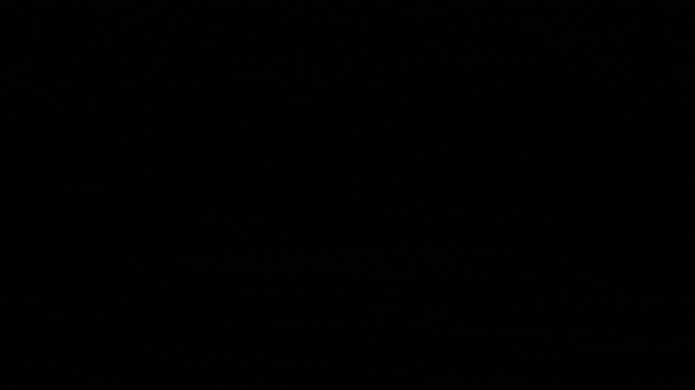
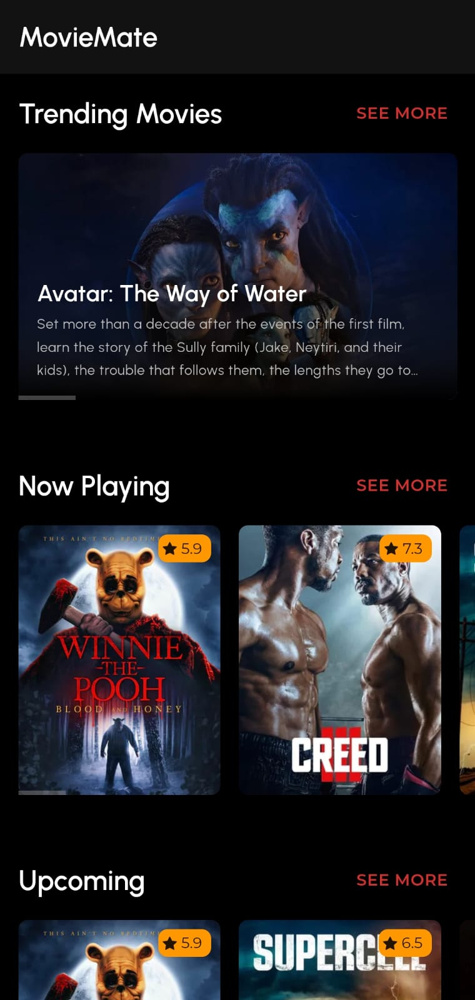
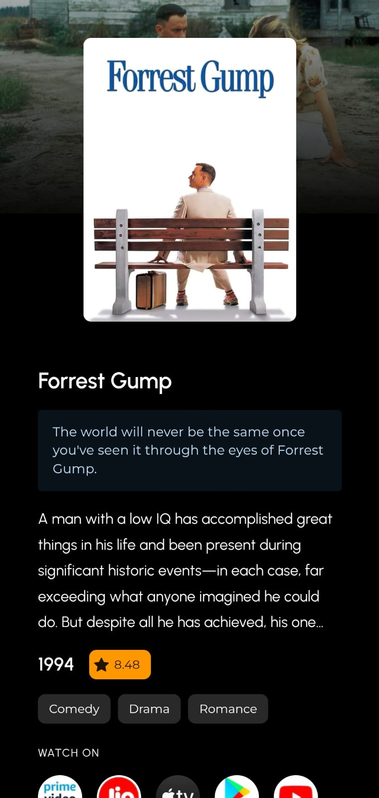
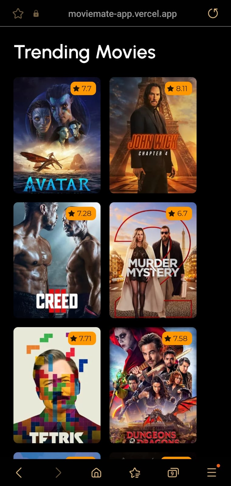
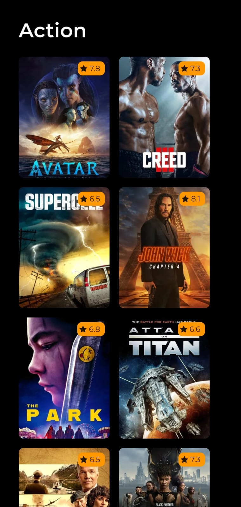

# **MovieMate**

Discover your next favorite movie with MovieMate - the ultimate movie guide with a hand-picked selection of the best
films.

## About 🎯

MovieMate is a movies showcasing web app built using the MERN Stack.
On MovieMate, how can see our curated list of content, immersive detail of movie and find out the perfect movie to
watch.
MovieMate uses the power of NextJS and ReactJS to provide blazing fast content and a great user experience.
From Static Side Generation to ServerSide Rendering to API Routes, it's all there in MovieMate.

## Try it out

You can try MovieMate by visiting: https://moviemate-app.vercel.app/

## MovieMate for you 🔥


[//]: # (Add Screenshots)

## 📸 Screenshots 🖥️

|                                                |                                              |
|------------------------------------------------|----------------------------------------------|
|      |  |
|  |  |

## 📸 Screenshots 📱

|                                                |                                              |                                                |                                              |
|------------------------------------------------|----------------------------------------------|------------------------------------------------|----------------------------------------------|
|      |  |  |  |


## Technical details 💡

- MovieMate is created using NextJS, ReactJS and MaterialUI.
- MovieMate uses the power of
  NextJS [ServerSide rendering](https://nextjs.org/docs/basic-features/pages#server-side-rendering) to provide content
  blazing fast.
- The HomeScreen of MovieMate
  uses [Static Site Generation](https://nextjs.org/docs/basic-features/pages#static-generation)
  with [Incremental Static Regeneration](https://nextjs.org/docs/basic-features/data-fetching/incremental-static-regeneration)
  set to every hour which makes it load instantly, so you dont have to wait.
- MovieMate uses the power of NextJs Api routes to make api calls to TMDB Api and prepare data for the screen
- MovieMate is highly responsive and looks great on all devices.
- All the React components and package structure is properly organized.

## Tech Stack

- [NextJs](https://nextjs.org) - Next.js enables you to create full-stack web applications by extending the latest React
  features, and integrating powerful Rust-based JavaScript tooling for the fastest builds.
- [React](https://react.dev) - The library for web and native user interfaces.
- [MaterialUI](https://mui.com) - MUI offers a comprehensive suite of UI tools to help you ship new features faster.
- [Axios](https://axios-http.com) - Promise based HTTP client for the browser and node.js
- [TMDB API](https://www.themoviedb.org) - The Movie Database (TMDb) is a community built movie and TV database.
- [Typescript](https://www.typescriptlang.org) - TypeScript is a strongly typed programming language that builds on
  JavaScript, giving you better tooling at any scale.

## Project Setup ✏️

To clone this project and customize it further, you need to do a couple of tasks first:

1) Clone this project. You can directly download the source code .zip file, or you can use the git clone command in
   terminal
2) Once successful, open your preferred IDE and run some tasks and write some setup code.
3) Run the following commands in your terminal

    ```
    npm install
    ```

4) After this, create a new file with the exact name of ".env.local"
5) In the .env file, write:<br><br>

    ```
    TMDB_API_KEY=Your TMDB API Key
    BASE_URL=For development use http://localhost:3000 and for production use the domain on which you are hosting the app
    ```

6) You are all set up now! To start the app in development mode, run:

    ```
    next dev
    ```

7) And to start the frontend in production mode, run:

    ```
    next build
    next start
    ```

8) Then write localhost:3000 in your browser to be able to use MovieMate!

---

## Contact

If you need any help, you can connect with me.

Visit:- [Vaibhav Jaiswal](https://vaibhavjaiswal.vercel.app/#/)
